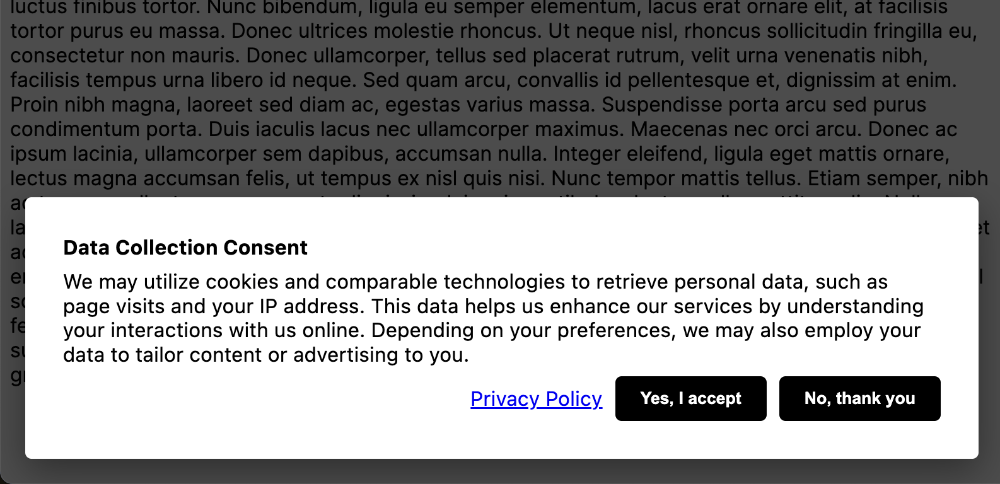
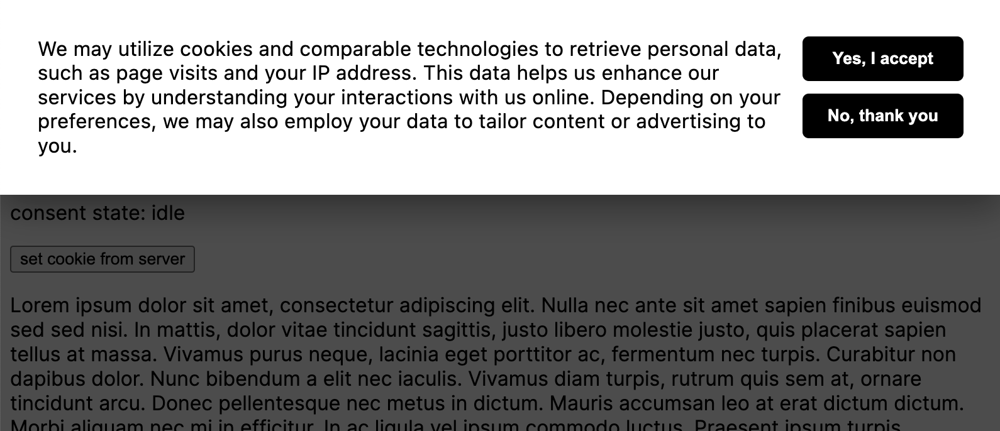

# consent-nextjs
- Cookie & Private Data Usage Consent Management System for Next.js.
- Aims to provide fastest way to setting it up.
- Developer experience oriented.

# Caveat

- Next.js 14 currently has bugs regarding client component. It is encoraged to use nextjs canary version.
- 👨‍⚖️The legal compliance of the provided text may vary by country. It's best to use it only for quick initial deployment and verification, and afterward, it's a good idea to seek legal advice.

# Install

```
# all in one install
npm i consent-nextjs
# separate install
npm i @consent-nextjs/client @consent-nexjts/ui @consent-nextjs/lang
```

- `consent-nextjs`: all in one
- `@consent-nextjs/client`: nextjs provider, client hooks
- `@consent-nextjs/ui`: popup, banner UI
- `@consent-nextjs/lang`: languages

# Screenshot

- Popup UI


- Banner UI


# Get Started

```tsx
// --- consent.ts
'use client';
import { initUseConsent } from 'consent-nextjs';
// import { initUseConsent } from '@consent-nextjs/client';

export const { useConsent } = initUseConsent();

// --- components/Popup.tsx
import { enUS } from '@consent-nextjs/lang';
import { PopupConsent } from '@consent-nextjs';
// import { PopupConsent } from '@consent-nextjs/ui/PopupConsent';
// import { BannerConsent } from '@consent-nextjs/ui/BannerConsent';
import { useConsent } from './consent';

const Popup = () => {
  const { consentState, onRejectClick, onConsentClick } = useConsent();
  const showPopup = consentState.consent === 'idle' && consentState.showPopup;

  if (!showPopup) return null;
  return (
    <div data-comp="consent-nextjs-overlay">
      <PopupConsent
        areaTop={<b>{enUS.title}</b>}
        areaBottom={
          <>
            <a href="/privacy" style={{ textAlign: 'center' }}>
              Privacy Policy
            </a>
            <button onClick={() => onConsentClick()}>{enUS.buttonConsent}</button>
            <button onClick={() => onRejectClick()}>{enUS.buttonReject}</button>
          </>
        }
      >
        {enUS.consentGeneral}
      </PopupConsent>
    </div>
  );
};

export default Popup;

// --- components/ClientProvider.tsx
'use client';
import { ConsentProvider } from 'consent-nextjs';
// import { ConsentProvider } from '@consent-nextjs/client';
import dynamic from 'next/dynamic';
import Script from 'next/script';
import { PropsWithChildren } from 'react';
const Popup = dynamic(() => import('./Popup'), { ssr: false });

const ClientProvider = ({ children }: PropsWithChildren) => {
  return (
    <ConsentProvider
      scriptSlots={
        {/* scripts are automatically enabled when user consents */}
        <>
          <Script id="google-ga" />
          <Script id="some-ad" />
        </>
      }
    >
      {children}
      <Popup />
    </ConsentProvider>
  );
};

export default ClientProvider;

// --- layout.tsx
// default theme, dark and light
import 'consent-nextjs/ui/style-popup.css';
import 'consent-nextjs/ui/style-overlay.css';
const Layout = () => {
  return (
    <html lang="en">
      <body>
        <ClientProvider>{children}</ClientProvider>
      </body>
    </html>
  );
};
```

# Alternative/Banner Style UI

```jsx
import { enUS } from '@consent-nextjs/lang';
import { BannerConsent } from '@consent-nextjs';
// import { BannerConsent } from '@consent-nextjs/ui/BannerConsent';
import { useConsent } from './consent';
const Popup = () => {
  const { consentState, onRejectClick, onConsentClick } = useConsent();
  const showPopup = consentState.consent === 'idle' && consentState.showPopup;

  if (!showPopup) return null;
  return (
    <div data-comp="consent-nextjs-overlay">
      <BannerConsent
        areaControl={
          <>
            <button onClick={() => onConsentClick()}>{enUS.buttonConsent}</button>
            <button onClick={() => onRejectClick()}>{enUS.buttonReject}</button>
          </>
        }
      >
        <>
          <p>{enUS.consentGeneral}</p>
          <a href="/privacy" style={{ textAlign: 'center' }}>Privacy Policy</a>
        </>
      </BannerConsent>
    </div>
  );
};
```